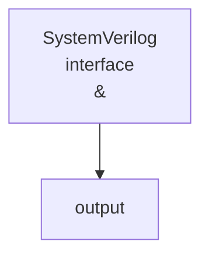

there are 3 data types in AXI4 stream
	+ Data
	+ Position
	+ Null

# AXI4S VIP overview

+ generating master payload and command
+ generating slave read payload and give responses
+ checking protocol compliance of AXI4-stream transaction

also AXI4S VIP has 3 mode
+ master
+ slave 
+ pass through

[[AXI4 interface.canvas]]